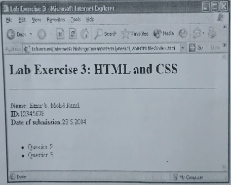

# HTML5

HTML5 est la dernière version du langage de balisage HTML, utilisée pour
structurer et enrichir le contenu des pages web avec des fonctionnalités
multimédias et sémantiques avancées.

HTML5, ou **HyperText Markup Language 5**, est le langage fondamental du
web, servant à définir la structure et le contenu d'une page web, comme
les titres, paragraphes, images, liens et formulaires.

Contrairement aux langages de programmation, HTML5 ne permet pas de
créer des logiques complexes, mais il « balise » le contenu pour
indiquer au navigateur comment l'afficher.

## Les balises HTML

> **Une balise HTML est un code utilisé pour structurer et organiser le
> contenu d'une page web, permettant aux navigateurs de l'afficher
> correctement.**

### Définition et rôle

Une balise HTML est un élément du langage HTML (**HyperText Markup
Language**) qui sert à encadrer du contenu pour lui donner une structure
et un sens. Elle indique aux navigateurs comment afficher le texte, les
images, les liens, les tableaux ou tout autre élément d'une page.

Les balises permettent également de hiérarchiser l'information.

## 1. Structure d'une balise

La plupart des balises HTML se composent de deux parties :

-   **Balise ouvrante** : marque le début de l'élément, par exemple
    `<p>` pour un paragraphe.
-   **Balise fermante** : marque la fin de l'élément, par exemple
    `</p>`.

Le contenu entre ces deux balises constitue **l'élément HTML**.
Certaines balises sont **auto-fermantes ou vides**, comme `<br>` pour un
saut de ligne, et n'ont pas besoin de balise de fin.

### Attributs

Les balises peuvent contenir des **attributs** qui fournissent des
informations supplémentaires sur l'élément, comme `src` pour l'URL d'une
image ou `alt` pour le texte alternatif. Ces attributs permettent de
personnaliser le comportement ou l'apparence de l'élément.

### Exemples courants

-   `<h1>` à `<h6>` : titres hiérarchisés
-   `<p>` : paragraphe
-   `` : image
-   `<a href="https://exemple.com">Lien</a>` : lien hypertexte
-   `<ul>` et `<li>` : listes à puces
-   `<strong>` et `<em>` : texte en gras ou en italique pour mettre en
    valeur

### Importance

Les balises HTML sont essentielles pour :

-   Structurer le contenu d'une page web
-   Assurer la compatibilité entre navigateurs
-   Faciliter le référencement et l'accessibilité
-   Intégrer des médias et des fonctionnalités interactives

En résumé, les **balises HTML** sont les briques de base d'une page web,
permettant de définir la structure, la mise en forme et le sens du
contenu pour les navigateurs et les utilisateurs.

## Exemple d'une page HTML

``` html
<!DOCTYPE html>
<html>
<head>
    <meta charset="utf-8" />
    <title>Ma première page HTML</title>
</head>
<body>
    <h1>Bienvenue sur ma page</h1>
    <p>Ceci est un paragraphe d’exemple.</p>

    <h2>Navigation</h2>
    <ul>
        <li><a href="#accueil">Accueil</a></li>
        <li><a href="#apropos">À propos</a></li>
        <li><a href="#contact">Contact</a></li>
    </ul>

    <h2 id="accueil">Accueil</h2>
    <p>Voici une section d’accueil simple.</p>

    <h2 id="apropos">À propos</h2>
    <p>Une courte description de la page.</p>

    <h2 id="contact">Contact</h2>
    <p>Envoyez-nous un message pour plus d’informations.</p>

    <footer>
        <p>© 2026 Mon Site Web</p>
    </footer>
</body>
</html>
```
**Explications des éléments essentiels**
* `<!DOCTYPE html>` : indique au navigateur que la page utilise HTML5.
* `<meta charset="utf-8">` : garantit un bon encodage des caractères, recommandé pour tous les projets.
* Titres `<h1>` à `<h6>` : utilisés pour structurer le contenu.
* Paragraphes `<p>` : pour le texte.
* Listes `<ul>` / `<ol>` et `<li>` : utiles pour organiser des éléments.
* Liens `<a>` : permettent de naviguer entre sections ou pages.

Activité: reproduire la mise en forme en html

<!-- Place for photo -->
