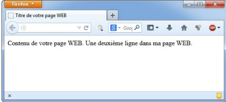
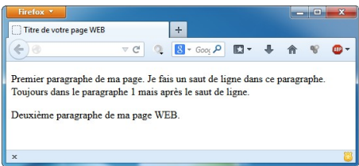
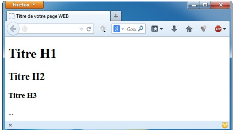
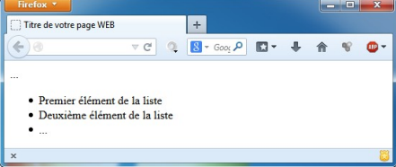
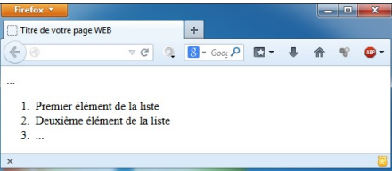

# Premières balises

Modifier la partie `<body>` du code précédent ainsi :

```html
<body><!-- Corps de la page -->
Contenu de votre page WEB.
Une deuxième ligne dans ma page WEB.
</body>
```

Ce code HTML produit l’affichage ci-dessous dans le navigateur :



## Saut de ligne et paragraphes

Il n'y a pas de retour à la ligne dans le navigateur ! En effet, les sauts de lignes que l'on met dans notre fichier HTML ne sont pas pris en compte par le navigateur.
Pour faire un saut de ligne, il faut utiliser la balise `<br>`, le code correct est :

```html
<body><!-- Corps de la page -->
Contenu de votre page WEB.<br>
Une deuxième ligne dans ma page WEB.
</body>
```

La balise `<p>` permet d'organiser la page web en paragraphes. Par rapport à un saut de ligne, les 2 paragraphes seront séparés par une interligne.

```html
<body><!-- Corps de la page -->
 <p>Premier paragraphe de ma page. Je fais un saut de ligne dans ce paragraphe.<br/>Toujours dans le
paragraphe 1 mais après le saut de ligne.</p>
 <p>Deuxième paragraphe de ma page WEB.</p>
</body>
```


## Les titres

Les balises `<h1>` à `<h6>` permettent d'appliquer différents niveaux de titres au document HTML. Les mots clés employés dans les titres sont très importants pour le référencement des pages WEB car les moteurs de recherche leurs accordent un poids important.

Exemple :

```html
<body><!-- Corps de la page -->
<h1>Titre H1</h1>
<h2>Titre H2</h2>
<h3>Titre H3</h3>
</body>
```

Ce code HTML produit l'affichage ci-dessous dans le navigateur :



## Les listes

### Liste à puces (non numérotée)

L'insertion d'une liste à puces se fait avec la balise `<ul>`. Les éléments de la liste sont ensuite délimités par la balise `<li>`.

Exemple :

```html
<body><!-- Corps de la page -->
<!-- Liste à puces (non numérotée) -->
<ul>
<li>Premier élément de la liste</li>
<li>Deuxième élément de la liste</li>
<li>...</li>
</ul>
</body>
```

Ce code HTML produit l'affichage ci-dessous dans le navigateur :



### Liste numérotée

L'insertion d'une liste numérotée se fait avec la balise `<ol>`. Les éléments de la liste sont ensuite délimités par la balise `<li>`.

Exemple :

```html
<body><!-- Corps de la page -->
<!-- Liste numérotée -->
<ol>
<li>Premier élément de la liste</li>
<li>Deuxième élément de la liste</li>
<li>...</li>
</ol>
</body>
```

Ce code HTML produit l'affichage ci-dessous dans le navigateur :


